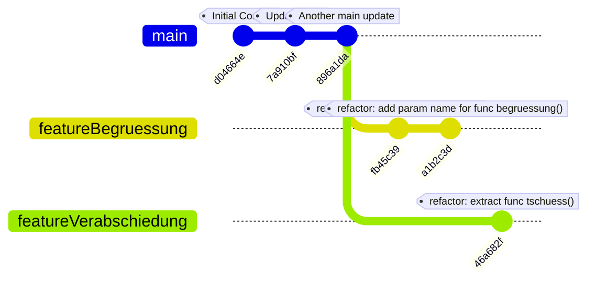
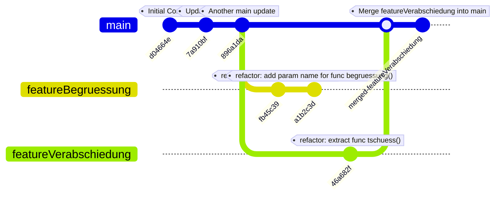
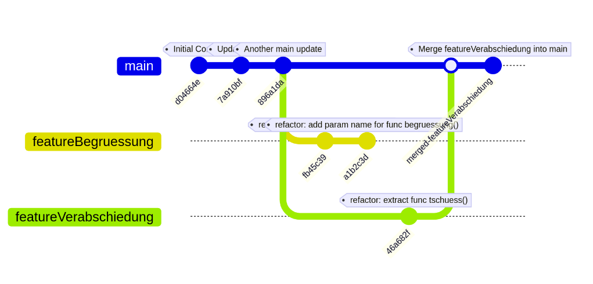
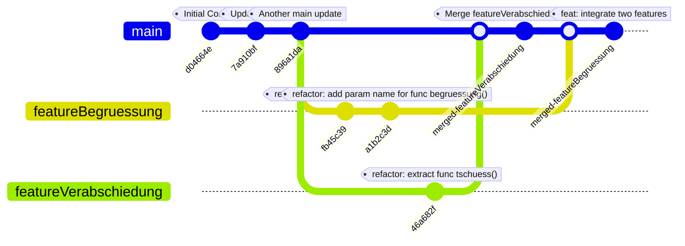
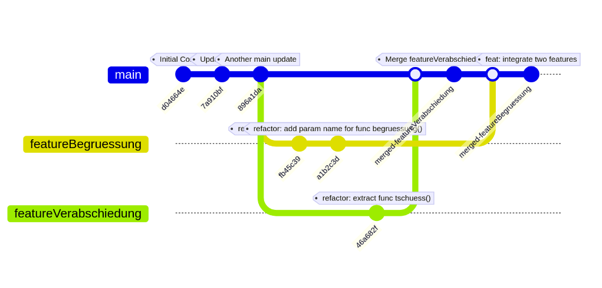

# Versionieren mit unterschiedlichen Zweigen (Branches)

## Einführung

Ein großer Vorteil von Git ist, dass wir zeitgleich an unterschiedlichen Komponenten eines Projekts arbeiten können und diese Entwicklungen zu definierten Zeitpunkten wieder zusammenführen können. Diese Entwicklung in Branches minimiert Seiteneffekte.

## Voraussetzungen

- Git ist installiert und konfiguriert
- Zugriff auf das bereitgestellte Repository

## Aufgabe 1: Einen neuen Zweig/Branch anlegen

Bislang haben wir immer im selben Zweig (main) unserer Entwicklung gearbeitet.

```bash
git status

On branch main [...]
```

Das ist jedoch nicht praktikabel, wenn wir zeitgleich an unterschiedlichen Features arbeiten oder unterschiedliche Entwicklungspersonen am gleichen Projekt arbeiten.
Daher ist es sinnvoll, zu definierten Zeitpunkten Schnittstellen zu schaffen - und zwischen diesen Schnittstellen relativ frei von Abhängigkeiten zu anderen Features/Projektbeteiligten arbeiten zu können.

Man zweigt also mit git an einem bestimmten Punkt die Entwicklung ab und erstellt einen neuen Zweig (Branch) mit dem Befehl `git branch branchname`. In diesem Branch können wir eine neue Funktionalität entwickeln und diese erst wenn sie fertiggestellt ist wieder in das Hauptprojket integrieren. Wir wollen die Begrüßung der `hallo.py` als Feature in eine Python-Funktion auslagern

1. Clone das bereitgestellte Repository
2. Erstelle einen neuen Branch mit dem Namen `feature/Begruessung`:
```bash
git branch feature/Begruessung
```
3. Wechsle zu diesem Branch:
```bash
git checkout feature/Begruessung
```
Alternativ kannst du beide Schritte kombinieren:
```bash
git checkout -b feature/Begruessung
```
4. Überprüfe deinen aktuellen Branch:
```bash
git status
```
Abkürzung: einen Branch erzeugen und direkt auswählen kann man mit `git checkout -b branchName`

## Aufgabe 2: Änderungen im neuen Branch vornehmen

In diesem Branch wollen wir die Begrüßung in `hallo.py` als Feature in eine Python-Funktion auslagern.

1. Öffne die Datei `hallo.py` und ändere sie wie folgt:
```python
def begruessung():
  name = input("Bitte geben Sie den Namen ein: ")
  print("Hallo", name, "!")

begruessung()
print("Auf Wiedersehen!")
```
2. Führe diese Änderungen ins Repository ein:
```bash
git add hallo.py
git commit -m "refactor: extract func begruessung()"
```
3. Verbessere die Funktion, indem du den Namen als Parameter übergibst:
```python
def begruessung(name:str):
  print("Hallo", name, "!")

name = input("Bitte geben Sie den Namen ein: ")
begruessung(name)
print("Auf Wiedersehen!")
```
4. Committe diese Änderung:
```bash
git add hallo.py
git commit -m "refactor: add param name for func begruessung()"
```
5. Überprüfe das Log:
```bash
git log --oneline --graph --all
```

## Aufgabe 3: Ein zweites Feature anlegen

Parallel zur Entwicklung der Begrüßung soll auch die Verabschiedung angepasst werden. Ausgangspunkt ist wieder der `main`-Zweig.

1. Wechsle zurück zum `main`-Branch:
```bash
git checkout main
```
Hinweis: Beobachte, wie sich deine Datei zurück zum ursprünglichen Zustand ändert!

2. Erstelle einen neuen Branch `feature/Verabschiedung`:
```bash
git checkout -b feature/Verabschiedung
```
3. Implementiere eine Funktion zur Verabschiedung in `hallo.py`:
```python
name = input("Bitte geben Sie den Namen ein: ")
print("Hallo", name, "!")
tschuess(name)

def tschuess(name:str):
  print("Auf Wiedersehen,", name, "!")
```
4. Committe deine Änderungen:
```bash
git add hallo.py
git commit -m "refactor: extract func tschuess()"
```
5. Überprüfe die Branch-Struktur:
```bash
git log --oneline --graph --all
```

## Aufgabe 4: Zwei Branches mergen

Wir haben jetzt im Ganzen drei Branches: zwei neue Featurebranches an den “Enden” des git-Baums.
<!---

-->


Jetzt wollen wir die entwickelten Features in den Hauptzweig integrieren.

1. Wechsle zum `main`-Branch:
```bash
git checkout main
```
2. Führe den Branch `feature/Verabschiedung` mit `main` zusammen:
```bash
git merge feature/Verabschiedung
```
3. Überprüfe das Ergebnis:
```bash
git log --oneline --graph --all
```
Da main keine weiteren Änderungen enthält, werden einfach die Änderungen des Feature-Branches übernommen. Im Graphen kann man erkennen, dass main jetzt nicht mehr an der Abzweigung steht, sondern am Ende des Zweiges.

<!---

-->



## Aufgabe 5: Merge-Konflikte lösen

Nun merge den zweiten Feature-Branch:
```bash
git merge feature/Begruessung
```

Beim Zusammenführen des zweiten Branches wirst du auf einen Merge-Konflikt stoßen. Das passiert häufig, wenn Änderungen in unterschiedlichen Zweigen die gleiche Zeile betreffen.

```bash
Auto-merging hallo.py
CONFLICT (content): Merge conflict in hallo.py
Automatic merge failed; fix conflicts and then commit the result.
```

1. Öffne die Datei mit dem Konflikt und suche nach den Markierungen:
```git
<<<<<<< HEAD
[Aktuelle Änderungen]
=======
[Eingehende Änderungen]
>>>>>>> feature/Begruessung
```

An allen Stellen, die git nicht selbst lösen konnte, werden die beiden Varianten zwischen spitzen Klammern (<<<, >>>) getrennt durch Gleichheitszeichen (===).

2. Bearbeite die Datei, um beide Funktionen zu integrieren:
```python
def begruessung(name:str):
print("Hallo", name, "!")

def tschuess(name:str):
  print("Auf Wiedersehen,", name, "!")

name = input("Bitte geben Sie den Namen ein: ")
begruessung(name)
tschuess(name)
```

3. Füge die gelöste Datei hinzu und schließe den Merge ab:
```bash
git add hallo.py
git commit -m "feat: integrate two features"
```

4. Überprüfe das Ergebnis:
```bash
git log --oneline --graph --all
```
<!---

-->


## Aufgabe 6: Rebase - eine Alternative zum Merge

Eine alternative Methode zum Zusammenführen von Branches ist das Rebase.

1. Erstelle einen neuen Feature-Branch `feature/time`:
```bash
git checkout -b feature/time
```
2. Ergänze eine Funktion zur Zeitansage in `hallo.py`:
```python
import datetime

def begruessung(name:str):
  print("Hallo", name, "!")

def tschuess(name:str):
  print("Auf Wiedersehen,", name, "!")

def saytime():
  print("Es ist "+str(datetime.datetime.now().strftime('%H:%M:%S')))

name = input("Bitte geben Sie den Namen ein: ")
begruessung(name)
saytime()
tschuess(name)
```
3. Committe deine Änderungen:
```bash
git add hallo.py
git commit -m "feat: add timeinfo"
```
4. Ändere nun die Formatierung der Zeitausgabe und commite erneut:
```bash
git add hallo.py
git commit -m "feat: correct typos"
```
5. Unterdessen wurde ein Tippfehler in main entdeckt: es soll nach dem Vornamen, nicht nach dem Namen gefragt werden. Die Änderung soll direkt im Branch main erfolgen. Dazu muss dieser zunächst wieder geladen werden (Achtung: die Dateien um Dateisystem ändern sich mit diesem Befehl). Wechsle zum `main`-Branch und mache dort Änderungen:
```bash
git checkout main

# Ändere die Eingabeaufforderung und committe

git add hallo.py
git commit -m "fix: ask politely for surname instead name"
```
6. Führe ein Rebase durch:
```bash
git checkout feature/time
git rebase main
```
7. Löse auftretende Konflikte und führe dann einen Fast-Forward-Merge durch:
```bash
git checkout main
git merge feature/time
```

## Aufgabe 7: Gezielt einzelne Commits als aktuell auswählen

1. Finde heraus, wo sich aktuell der `HEAD` befindet:
```bash
git log
```
2. Setze den `HEAD` auf einen früheren Commit:
```bash
git checkout HASH
```
3. Beachte die Warnung zum "detached HEAD state"
4. Kehre zum `main`-Branch zurück:
```bash
git checkout main
```

## Zusammenfassung

In dieser Übung hast du gelernt:
- Wie man Branches erstellt und zwischen ihnen wechselt
- Wie man Änderungen in verschiedenen Branches vornimmt
- Wie man Branches mit Merge zusammenführt und Konflikte löst
- Wie man Rebase als Alternative zu Merge verwendet
- Wie man den HEAD auf bestimmte Commits setzt

Branches sind ein mächtiges Werkzeug in Git, das paralleles Arbeiten an verschiedenen Aspekten eines Projekts ermöglicht.

**Überarbeitete Version von:** 
- “Versionskontrollsystem git: Erste Schritte” von oer-informatik.de (H. Stein), Lizenz: CC BY 4.0. Der Artikel wurde unter https://oer-informatik.de/git01-repo_anlegen_und_lokal_commiten veröffentlicht, die Quelltexte sind in weiterverarbeitbarer Form verfügbar im Repository unter https://gitlab.com/oer-informatik/devoptools/git. Stand: 15.03.2024.
- “Versionieren mit unterschiedlichen Zweigen (Branches)” von oer-informatik.de (H. Stein), Lizenz: CC BY 4.0. Der Artikel wurde unter https://oer-informatik.de/git02-versionieren_mit_branches veröffentlicht, die Quelltexte sind in weiterverarbeitbarer Form verfügbar im Repository unter https://gitlab.com/oer-informatik/devoptools/git. Stand: 27.05.2023.
-  “git im Team und Remote nutzen” von oer-informatik.de (H. Stein), Lizenz: CC BY 4.0. Der Artikel wurde unter https://oer-informatik.de/git03-remote_nutzen veröffentlicht, die Quelltexte sind in weiterverarbeitbarer Form verfügbar im Repository unter https://gitlab.com/oer-informatik/devoptools/git. Stand: 15.03.2024.